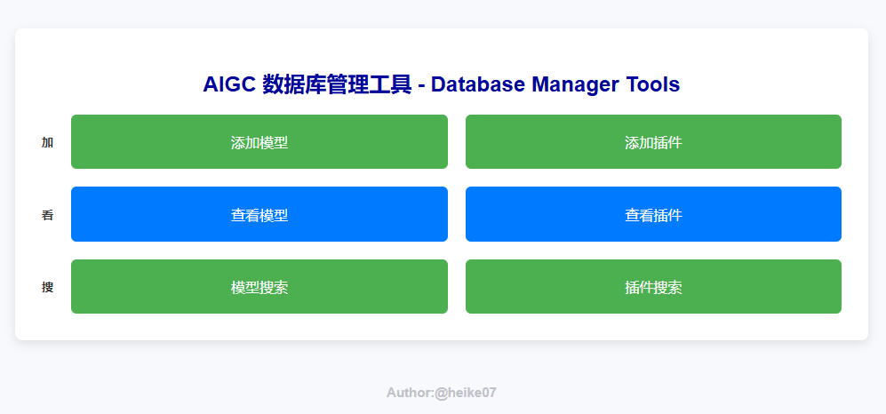

# AIGC 数据库管理工具 - Database Manager Tools

**Author: Heike07**

这是一个基于 Flask 框架和 Python 开发的简单 CRUD（创建、读取、更新、删除）应用程序。该项目提供了针对 ComfyUI 模型和插件的查询、添加和搜索功能。目前暂不提供删除和修改功能。

## 主界面



## 功能

- **查询模型和插件**：允许从数据库中获取有关 ComfyUI 模型和插件的数据。
- **添加模型和插件**：提供接口向数据库中添加新的模型和插件。
- **搜索**：支持通过名称或其他属性搜索模型和插件。

当前**不提供删除**和**更新**功能。

## 安装

### 配置文件

1. 找到项目中的 `config_EXP.ini` 配置文件，并将其重命名为 `config.ini`。
2. 打开 `config.ini` 文件，填写正确的数据库连接信息、应用配置以及日志配置。

#### `config.ini` 示例配置：

```ini
[database]
# 数据库连接配置
dbname = your_database_name
user = your_username
password = your_password
host = your_host
port = 5432

[app]
# Flask 配置
secret_key = your_secret_key
debug = True

[logging]
# 日志配置
log_level = DEBUG
log_file = /path/to/your/log/file.log
```
在 [database] 部分，填入你自己的 PostgreSQL 数据库信息：
 - dbname：数据库名称
 - user：数据库用户名
 - password：数据库密码
 - host：数据库主机（如 localhost）
 - port：数据库端口（默认是 5432）

在 [app] 部分，设置 Flask 应用的配置：
 - secret_key：用于 Flask 安全性相关的密钥，建议使用随机生成的字符串。
 - debug：是否启用调试模式，生产环境中应设置为 False。

在 [logging] 部分，配置日志：
 - log_level：日志等级（如 DEBUG, INFO）。
 - log_file：日志文件路径。

 ## 使用
 ```shell
 python app.py
 ```

 ## 接口说明
  - 添加新模型 POST /add_model
 ```json
 {
  "name": "新模型",
  "description": "新模型的描述。",
  "version": "1.0",
  "path": "/models/new_model"
}
 ```
  - 添加新插件 POST /add_plugin
 ```json
{
  "name": "新插件",
  "description": "新插件的描述。",
  "version": "1.0",
  "path": "/plugins/new_plugin"
}
 ```
  - 搜索模型和插件 GET /search?name=New
  ```json
  此请求将搜索名称为“New”的模型或插件。
  ```
## 贡献
欢迎贡献！请先 fork 本仓库，在新分支上进行开发，完成后提交 Pull Request。

END